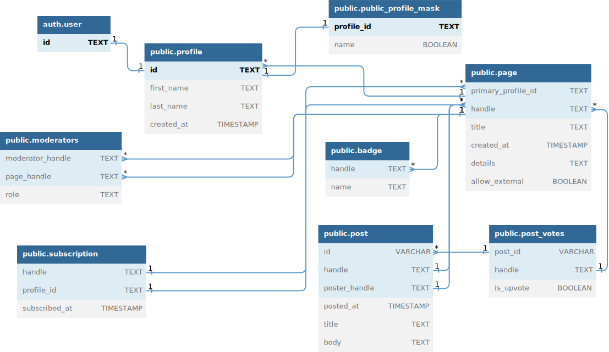

<body>
   <h1>ULTIMA</h1>
   <section>
      <h2>Stack</h2>
      

      <ul>
         <li class="hot-3">
            
            Server Side Rendering (SSR)
            React Server Components
            Full Stack Framwork
         </li>
         <li class="hot-2">
            <h3>Tailwind</h3>
         </li>
         <li class="hot-2">
            <h3>React Query</h3>
         </li>
         <li class="hot-3">
            <a class="header" href="https://orm.drizzle.team/" title="Drizzle ORM">
               
               <h3 style="display: inline-block;">Drizzle Orm</h3>
            </a>
         </li>
      </ul>
   </section>
   <section>
      <h2>Database Schema</h2>
      

      
   </section>
</body>
